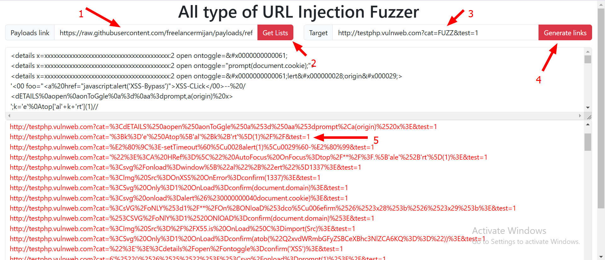

#### All type of URL injection fuzzer https://freelancermijan.github.io/urlfuzzer/

This is online based URL Fuzzer  tool. It's only fuzz ONE parameter at a time.

## Features. 

- **Fuzzing URLs:**
- **Custom payload option:**
- **Custom payload from online link:**
- **XSS Fuzzing:**
- **SQLi Fuzzing:**
- **LFI Fuzzing:**
- **Command Injection Fuzzing:**
- **All type of URL based injection attacks fuzzing:**
